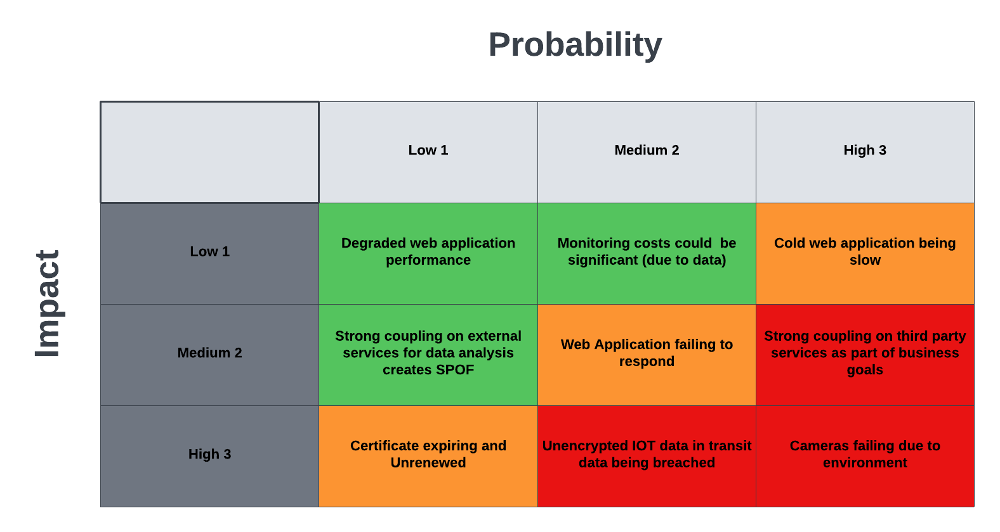

# Requirements Overview

Wildlife AI is a charitable trust using AI for wildlife conservation. Wildlife.ai work with grassroots wildlife conservation projects and develop open-source solutions using machine learning. They also 
organise community events, seminars and educational activities to build and maintain machine learning solutions to reduce the current rate of species extinction.

# Proposed Solution

The proposed solution is captured in the <a href="architecture.md">Architecture page</a>

# Assumptions

* We assume that a thorough vetting process is applied for accepting users onto the platform to ensure, as much as possible, that information regarding animals location and numbers are not made available to animal poachers and other such criminal organisations. We expect this facility to be in place as it will be very difficult for the application to ensure the user's genuine reasons for requesting such information. 
* Start with a mobile client and a web application. Same responsive and adaptive application (BFFs might be used in the future)
* Observability using Cloud native solutions at the beginnig. No particular reporting needs but the solution should accommodate such requirements in the future.

# Considerations

* Cameras will have to have the ability of connecting to a message broker using IoT protocols MQTT would be preferable. 
* Cameras will be programmed to send a heartbeat message at regular intervals for as long as they are live.

# Use Cases

* Upload to platforms
* View device information
* Analyse frames
* Analyse video

# Risks

* Animal poachers or such criminals can take advantage of the information made available through this solution
* Cameras may not have the necessary hardware capabilities to connect to the message broker for heartbeat and updates so more manual interventions required

# Priotised Architecture Characteristics

# Deployability
Wildlife.AI will potentially deploy hundreds, if not thousands, of cameras in the wild where network connectivity may be poor. We will require the cameras to be programmed to accommodate the following functions:
* Connect to a message broker of choice MQTT, AMQPS, HTTPS
* Send a Heartbeat message containing camera specific information (IP, device version, capabilities) at regular intervals
* Send captured images whenever a "Movement" event was triggered
* Connect to a specific message broker topic to collect updates - new ML model, new image to recognize, new software features

# Affordability
Wildlife.ai are a charity and thus any solution envisaged must be affordable and without costly third party licenses. The solution must avoid the use of expensive third-party solutions and use cloud native services avoiding cloud vendor lock-in.

# Availability
Employ architectural design patterns to handle exceptions and erros in such a way to maintain the following the availabiltiy for the following functionality:
* Endpoints for cameras to connect into as long as possible; starting with 1-nine of availability for the Streaming platform.
* Web application for Widlife.ai users' access to images, cameras management and observations is important but we consider that a 
Given the harsh environment wildlife.ai cameras operate in, the equipment must be able to endure and withstand physical damage as much as possible.

# Scalability
The architecture must ensure that the application can accommodate an increasing number of cameras. People can buy and install cameras at their own expense so the solution must be able to accommodate these cameras when they come online.
The application must also allow for a growing number of users, both regular users and camera administrators, to subscribe and operate on the platform

# Privacy
Access to the data captures regarding animals locations and other duch details represent important pieces of information for the future of animals concerned. Therefore, a thorough vetting process must be applied for accepting users onto the platform. The user registration process must have 3 stages: 
1. Registration - users register and submit the required documentation
2. Vetting - Wildlife.ai ensures that the person wanting to use the platform has been properly verified.
3. Activation - After the user has been vetted and allowed onto the platform an activation email and unique URL are being generated so that the user can finalise the activaton process.

# Observability
The platform must be highly observable, employing adequate monitoring and alerting facilities, so that it self-heals where possible but also that it informs the support teams to the error occurred.
The platform will also provide a way for monitoring and alerting in regards to the state of the cameras. The Observability service will subscribe to the Heartbeat topic and monitor the last time a camera was seen alive or battery low or any other issues that it may identify or infer from the Heartbeat, or lack of, messages. 

# Requirements

* REQ-001 - Users should be able to communicate with the camera remotely for reasons of management such as updating features, uploading subject images,uploading new ML models, downlaoding captured content, checking battery and other operational metrics.
* REQ-002 - Users should be able to analyse the videos using common camera trap labelling platforms
(Wildlife Insights, TrapTagger or Trapper).
* REQ-003 - Users should be able to publish frames from the videos to iNaturalist for experts to help with
the identification of the specie.
* REQ-004 Users should be able to easily train edge models. using their own labelled videos, and
upload the models to the cameras (using third party services like Roboflow, Edge Impulse or
TensorFlow Lite).
* REQ-005 Users should be able to publish the species occurrences to GBIF the Camtrap DP, data
exchange format.
* REQ-006 Cameras should be able to process the footage on the device and send a small alert
message to the users via LoraWan, 3G or satellite.

*REQ A map function will need to display all the locations with cameras installed in the region

# Architecture Principles

## Camera models and code must be very concise and quick and easy to deploy

## In addition, cameras should be tamper-proof.
To abide by defence in depth

# Effective architecture characteristics

| ID            | Characteristic | 	Applicable to | Source |
| -----------   | -----------    |----------------|--------|
| Header        | Privacy        | API, Camera    | REQ-001|
| Paragraph     | Deployability  | Camera         | REQ-008|
| Affordability | 

# Design Constraints

Lack of APIs on third party systems

# Architecture

# Threat Model

# Risk Storming

# Architectural Decision Records

* Use of healthcheck pattern
* Use of API Gateway for exposing a specific API to access Observations and related material (videos, images)
* Pub/Sub message broker for receiving information from the cameras
* Event-driven microservices architecture
* Cameras must provide Software Over the Air functionality via specific topic in the message broker
