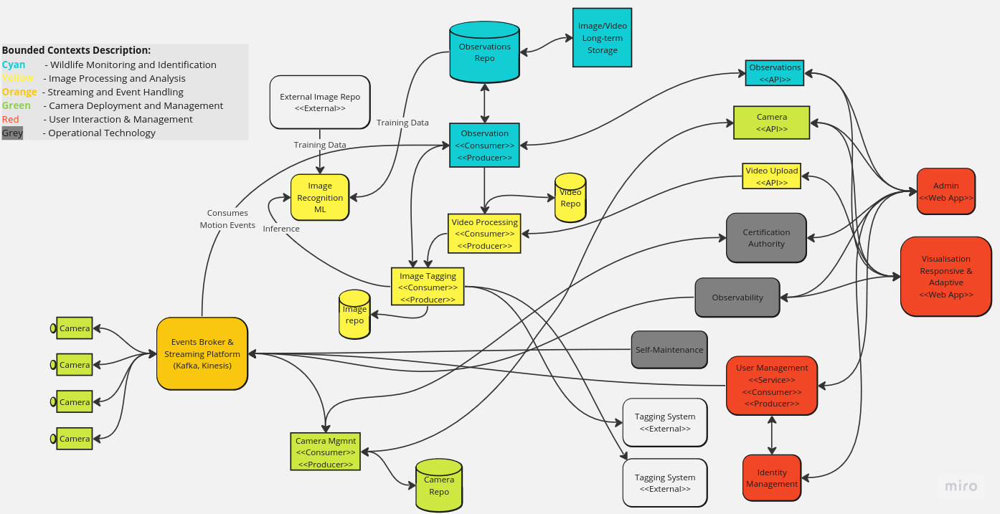
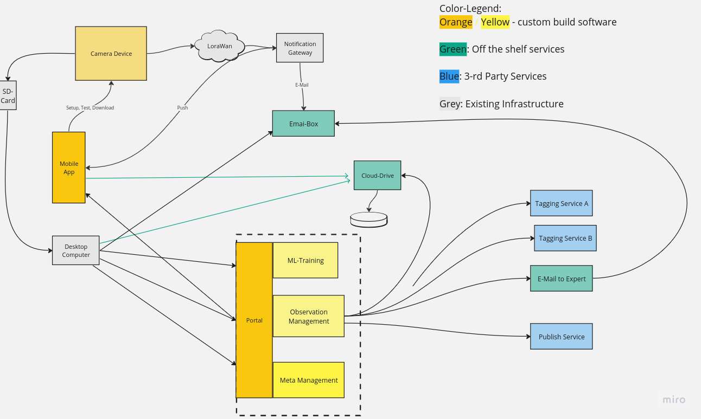

# Overview

Considering the functional requirements as well as the quality attributes covered in the <a href="README.md" target="_blank">README.md</a> file we have identified an architecture desin that may address these requirements. We are still debating the best way to progress the solution from a simple version focused on the Mobile app forst to a more feature rich platform tht can work with cameras connected via LoRaWAN as well as 3G or satellite and can accommodate a more complex review of images captured from motion triggers that may identify animals that have not been yet part of the training model for the ML recogniser.

# Components

<figure>
    
    <figcaption>Components Diagram using a streaming platform</figcaption>
</figure>

# Main Components Goals and Details

## Goals:

* Capture as many animals as possible
* Maintain an accurate view of the status of all cameras installed 
* Allow for any motion triggered captured image to be assessed for any animal spotting even if the ML model had already detected an animal

#### Capture as many animals as possible

When an animal is captured an <ins>Observation</ins> is created in the <ins>Observations</ins> repo.
Each Observation contains details about animal such as species, colour, etc. all identified from the image. It’ll also have the time and date, image, etc.
<ins>Animal spotted</ins> events get processed by the <ins>Image Processor</ins>. Image processor saves the image in an Images repo for additional human feedback. 
The <ins>Image Processor</ins> also sends the image to an external service for tagging and the response will be collated into an Observation and stored in the Observations repo.
Videos can be manually uploaded through the Web application and the Video upload service

#### Maintain an accurate view of the status of all cameras installed 

Cameras send events to the streaming platform. These events are:
* Heartbeat - location, camera ID similar to a network MAC, any faults like battery or net quality
* Animal spotted - image, local inference, time and date, etc.
* Faults - space gone, feature failures, etc.
Cameras can be administered through the application's web app and camera admin service. This service creates events in camera specific streams so that cameras can read them when online or at regular intervals. This reduces the complexity on the cameras as there’s no need for a separate web server to be hosted there and the corresponding services, security, Auth, etc. Cameras already connect to the streaming platform to send events so they can connect to receive events too.

Observations repo and the Images repo should be NoSQL databases as the messages can vary in structure depending on the kind of animal and its characteristics and also the repositories should be very quick for writing as that happens more than reading.

# Mobile app and LoRaWAN components view

<figure>
    
    <figcaption>Components Diagram showing mobile app and connectivity via LoRaWAN</figcaption>
</figure>

 When cameras connect via LoRaWAN the streaming platform is provided by the LoRaWAN network so the architecture can be simplefied a bit more.
