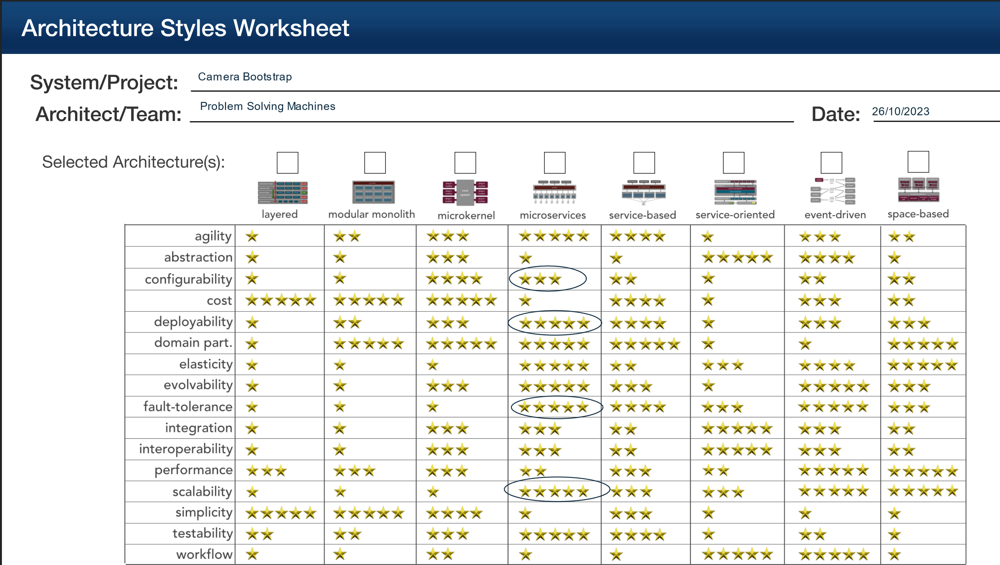

# Camera bootstrap

When a camera is deployed, it will need registering with the central registry. This could be a manual operation,
but this is not practical if a user deploys several or more cameras. In addition, it is a tenet of the proposal
that we facilitate allowing users to focus on value and the core domain - species management and sightings.

To this effect, a small program will need to run which will get the details of the camera and publish it to the registry.
This registry is used by the API to discover cameras belonging to specific users (i.e. partitioned on a UserID key).

Responsibilities:
- Bootstrap camera details to central registry
- Provide connectivity details
- Provide healthcheck endpoint

# Architecture Style

# Architecture Characteristics

