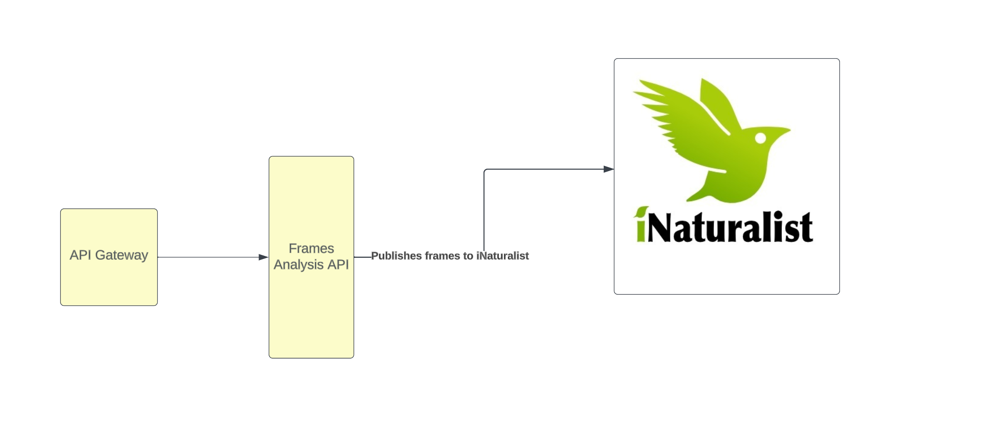

# Camera Management

Once a video is captured, users will need to analyse individual frames.

## Responsibilities

- Provide list of cameras
- Provide an overview of a camera, including its settings

